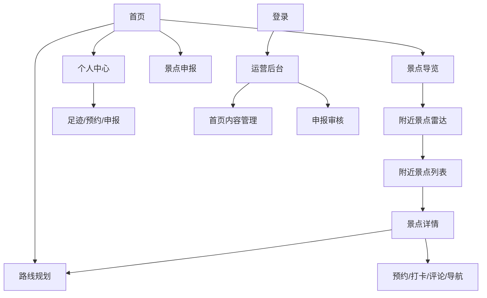
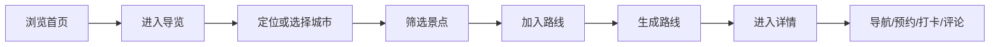

# 陌路寻景产品与设计方案

## PRFAQ

### 新闻稿

陌路寻景发布全新智慧文旅网站体验：把景点发现、附近导览、路线规划、预约票务、天气拥挤提示、游客评论、足迹打卡和运营管理整合到同一个清晰的旅行工作台。用户不再需要在攻略、地图、天气、票务与个人记录之间来回切换，只要进入陌路寻景，就能从“想去哪”自然走到“怎么去、何时去、到了做什么、回来留下什么”。

这次改版的核心不是堆功能，而是让功能有秩序。首页用真实目的地图片建立第一眼信任，用明确的任务入口承接不同意图：随便看看的人可以浏览精选景点；已经出发的人可以进入附近景点雷达；有计划的人可以把景点加入路线；运营人员可以维护首页内容和审核用户申报。景点详情页围绕现场决策展开：开放时间、门票、最佳季节、电话、天气、拥挤指数、周边设施、导航、打卡、语音导览、评论与预约都在一个上下文里。

陌路寻景面向三类用户：游客、内容贡献者和平台运营者。游客需要快速找到可靠景点并形成路线；贡献者需要把发现的好去处提交给平台；运营者需要管理景点、首页和申报审核。新体验让三类角色共用同一套视觉语言和组件系统，避免后台像另一个产品、前台像另一个网站。

视觉上，陌路寻景从“普通蓝色旅游网站”升级为更有辨识度的现代文旅工具：用深墨绿、暖砂、朱砂橙和雾白建立自然、文化与行动感；用地图切片、纸感纹理、指标数字和模块化卡片组织复杂信息；动效控制在 200-300ms，提供更轻的滚动与悬停反馈，并支持减少动态效果的系统偏好。

### FAQ

**Q: 陌路寻景解决什么问题？**  
A: 它解决旅行前后信息分散的问题。用户可以在一个网站完成发现景点、筛选附近、规划路线、查看天气拥挤、预约、导航、打卡、评论和查看个人足迹。

**Q: 为什么不是普通景点列表？**  
A: 因为游客的真实任务不是“看列表”，而是“决定去哪里、怎么去、是否值得去、到了之后做什么”。因此页面结构围绕任务流，而不是围绕数据库字段。

**Q: 核心路径是什么？**  
A: 首页了解服务价值，进入景点导览，定位附近景点，筛选并加入路线，进入路线规划生成顺序，打开景点详情完成导航、打卡、预约或评论。

**Q: 哪些功能不改？**  
A: 不改变现有后端接口、路由、登录方式、景点数据、预约、评论、申报和后台审核逻辑。本次重点是体验、文案、布局、状态和视觉系统。

**Q: 数据为空怎么办？**  
A: 空态不留白，显示明确下一步，例如“还没有选择景点，先去导览加入路线”“路线结果会显示在这里”“暂无申报”。加载、错误、禁用、成功状态都使用统一消息样式。

**Q: 移动端如何使用？**  
A: 移动端优先保留导航、筛选、卡片、路线选择和详情操作。复杂两栏布局自动变成单栏，地图与图片保持固定比例，按钮可触达。

## 需求洞察

### 用户角色

- 游客：浏览景点、查天气和拥挤、规划路线、导航、打卡、评论、预约。
- 内容贡献者：提交新景点资料、查看申报进度。
- 运营人员：登录后台、管理首页轮播、设置精选景点、审核用户申报、查看景点和设施概况。

### 核心使用场景

- 周末出行：从首页进入导览，定位后按距离和评分筛选，加入 2-5 个景点生成路线。
- 景点现场：打开详情页，查看天气拥挤、附近设施、导航入口，完成打卡和评论。
- 行前决策：查看门票、开放时间、最佳季节、历史导览、评论和语音导览。
- 内容运营：管理员维护首页视觉内容，把优质申报转入景点库。

### 核心任务路径

1. 发现：`首页 -> 精选景点/景点导览`
2. 定位：`景点导览 -> 附近景点雷达 -> 附近列表`
3. 计划：`景点卡片 -> 加入路线 -> 路线规划 -> 智能排序`
4. 决策：`景点详情 -> 天气/拥挤/设施/评论`
5. 行动：`导航/打卡/预约/语音导览`
6. 沉淀：`个人中心 -> 足迹/预约/申报`
7. 运营：`登录 -> 运营后台 -> 首页内容/申报审核`

### 边界与异常

- 定位失败：保留手动城市按钮，并给出权限提示。
- 地图 SDK 未启用或 AK 异常：地图区域显示可读错误，不阻塞其他内容。
- 路线少于 2 个景点：提示先选择至少 2 个景点。
- 路线超过 5 个景点：保留现有限制并提示。
- 评论为空：显示写第一条体验的行动提示。
- 图片加载慢：使用稳定比例容器，避免布局跳动。

### 数据结构

- ScenicSpot：id、name、type、address、latitude、longitude、rating、price、coverImage、gallery、description、guide、history、openHours、bestSeason、phone。
- RoutePlan：orderedSpots、segments、totalDistanceKm、totalMinutes。
- Review：id、spotId、userId、score、content、likes、source、parentId、likedUserIds、createdAt。
- Reservation：spotId、visitDate、timeSlot、people、qrCode、status。
- SpotSubmission：name、type、address、latitude、longitude、description、reason、photoUrls、status。
- HomeContent：hero slides、featured spot ids。

## PRD

### 目标

- 提升首屏吸引力和任务入口清晰度。
- 降低用户从发现到路线规划的操作成本。
- 让详情页成为现场决策中枢。
- 让后台管理与前台体验视觉一致。

### MoSCoW

- Must：保留全部现有功能；首页、导览、路线、详情、个人中心、申报、后台可访问；移动端可用；加载/错误/空态可读。
- Should：统一设计系统；修复明显乱码文案；强化图片和指标展示；提供减少动态效果支持。
- Could：为首页增加产品叙事区；为路线与详情补充更明确的任务说明；增强卡片悬停反馈。
- Won't：不改后端业务逻辑；不新增需要数据库迁移的功能；不引入复杂第三方 UI 框架。

### 信息架构

### 任务流

## 设计方案

### 灵感采样与转译

- Kenji Ekuan：他的工业设计强调“器物一眼可懂，握持和倒出都自然”。网页转译为清晰的任务入口、强语义按钮、稳定比例的地图与卡片，让用户知道下一步该做什么。
- Paul Klee：他的作品常以色块、线性节奏和诗性秩序建立空间感。网页转译为暖砂、墨绿、朱砂橙与雾白的分层色彩，配合细线、纸感和轻微错位的模块节奏。

### 组件清单

- 顶部导航：品牌、主导航、账户入口、刷新状态。
- Hero：真实图片、标题、行动按钮、轮播控制、精选数量提示。
- 任务入口卡：导览、路线、个人中心、申报。
- 景点卡：图片、类型、评分、距离、打卡状态、详情和加入路线按钮。
- 筛选工具栏：搜索、类型、排序、清空。
- 地图模块：加载、错误、正常状态。
- 路线工作台：出发地、已选景点、规划结果、交通方案。
- 详情中枢：图库、指标、导览历史、设施、预约、评论、天气拥挤、AI 问答。
- 后台表单：轮播编辑、精选景点选择、申报审核。

### 状态说明

- 默认：高对比文本、稳定间距、明确主操作。
- 悬停：卡片轻微上移，按钮背景变深，链接出现底部线。
- 激活：导航和分段按钮用深色实底。
- 禁用：降低透明度并保留文本可读性。
- 错误：使用浅红背景和深红文本。
- 空态：显示原因和下一步，不留空白。
- 加载：使用统一浅色容器文字提示。

### 可访问性与动效

- 文本和按钮对比度达标。
- 所有图像保留 alt。
- 图标按钮使用 title 或 aria-label。
- 动效控制在 200-300ms，首屏轮播保留渐变过渡。
- `prefers-reduced-motion: reduce` 下关闭动画和滚动平滑。

### Design Tokens

- 色彩：ink `#16231d`，muted `#637167`，paper `#fbf7ed`，surface `#fffdf7`，line `#ded4c3`，brand `#1f6f5b`，accent `#c7522a`，sun `#e6a93c`，night `#10231f`。
- 字体：系统中文字体，标题高字重，数字使用等宽字体。
- 栅格：容器最大 1180px，桌面 12 栏感知，卡片 auto-fit，任务区 4 栏，移动端单栏。
- 间距：4、8、12、16、24、32、48、64。
- 圆角：按钮/卡片 6-8px，大型媒体 18-24px。

### 关键页面线框

- 首页：顶部品牌导航；全屏宽 Hero 图片与行动按钮；四个任务入口；精选景点卡片；产品能力叙事带。
- 景点导览：页面标题；左侧筛选和卡片列表；右侧地图与已选路线；移动端地图下移。
- 景点详情：大图标题区；主内容为详情、图库、指标、历史、设施、预约和评论；右侧为天气、拥挤和智能问答。
